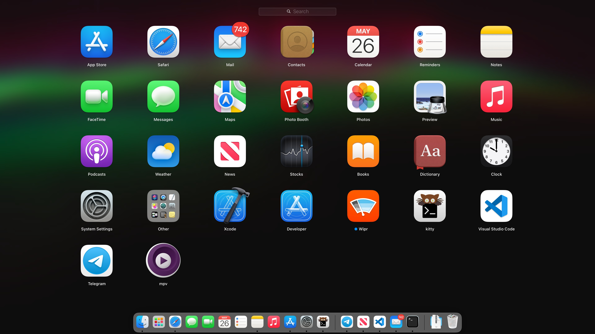
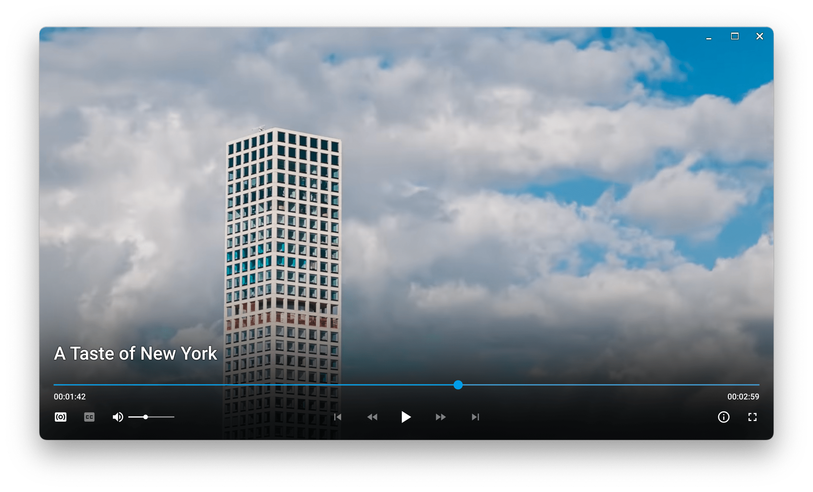

# mpv-app-bundle

The missing app bundle for Homebrew [mpv](https://github.com/mpv-player/mpv).

# Installation

First, You need to install **mpv** on macOS. Run the following command in the terminal:

```bash
brew install mpv
```

Now, you can install **mpv.app**. Run the following command in the terminal:

```bash
curl -L https://raw.githubusercontent.com/9beach/mpv-app-bundle/main/install-raw.sh | bash
```

After installation, you can find **mpv.app** in the `/Applications` folder and use context menu items to run media files.




For [Lua](https://www.lua.org) scripts and settings for mpv, please visit
[mpv-config](https://github.com/9beach/mpv-config).


