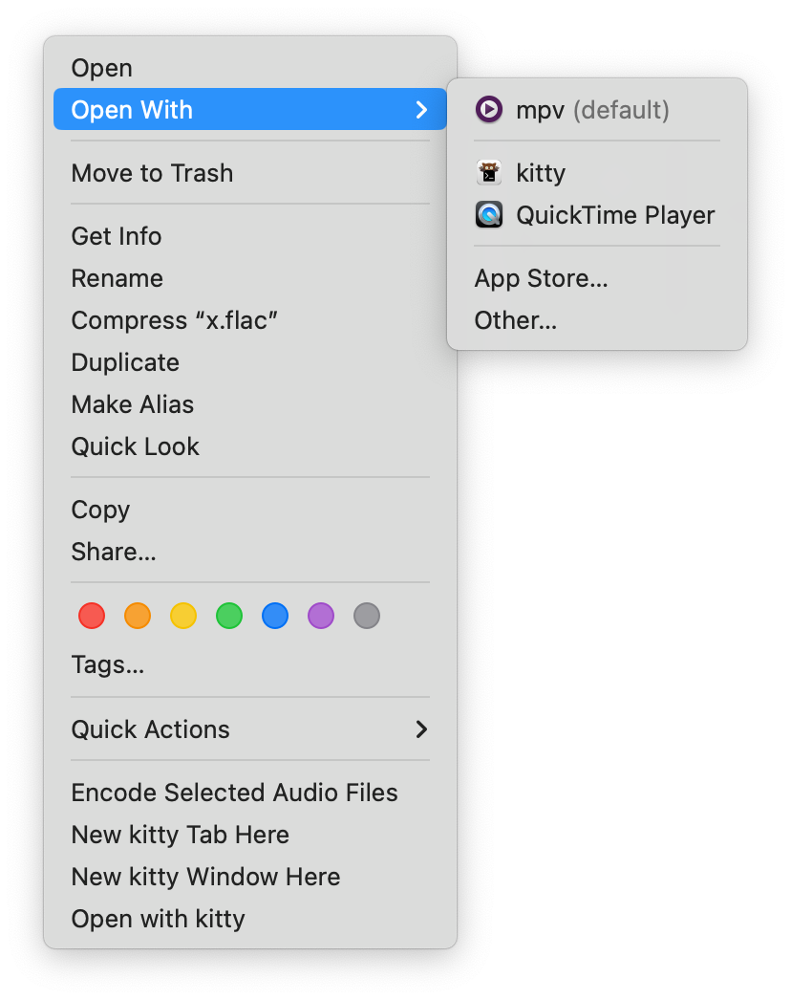

# mpv-app-bundle

The missing app bundle for Homebrew [mpv](https://github.com/mpv-player/mpv).

# Installation

```bash
git clone https://github.com/9beach/mpv-app-bundle.git
cd mpv-app-bundle
./install-mpv-bundle.sh
```

After installation, you can find **mpv.app** in the `/Applications` folder and use context menu items to run media files.




For [Lua](https://www.lua.org) scripts and settings for mpv, please visit
[mpv-config](https://github.com/9beach/mpv-config).


